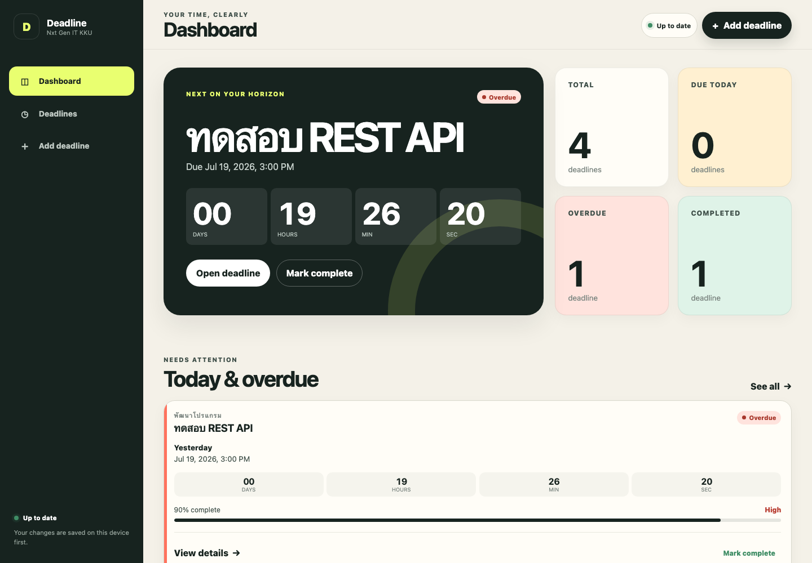
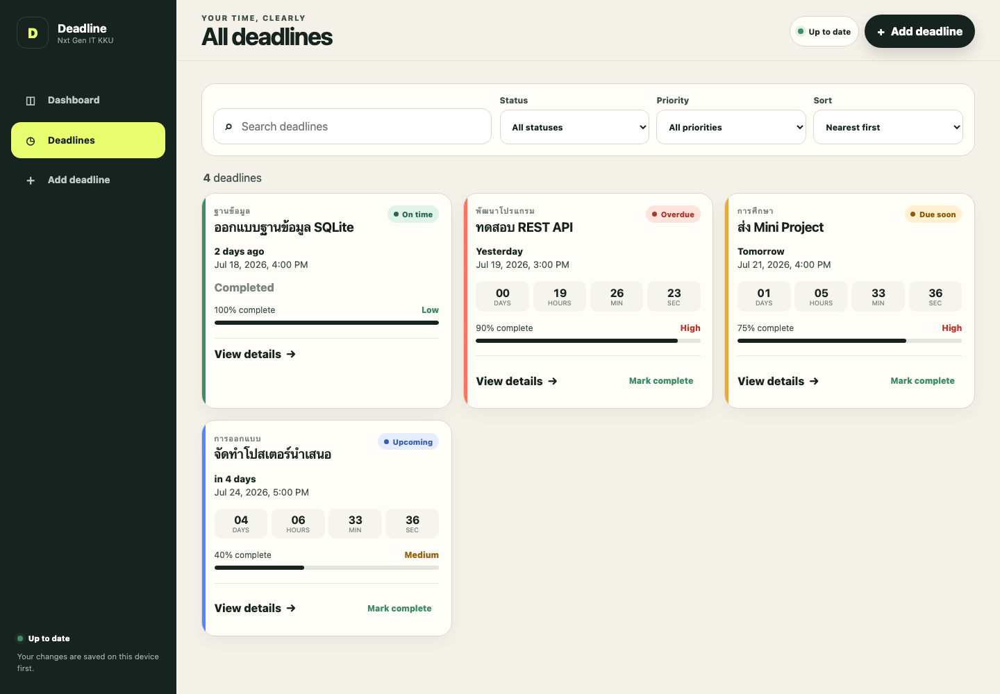
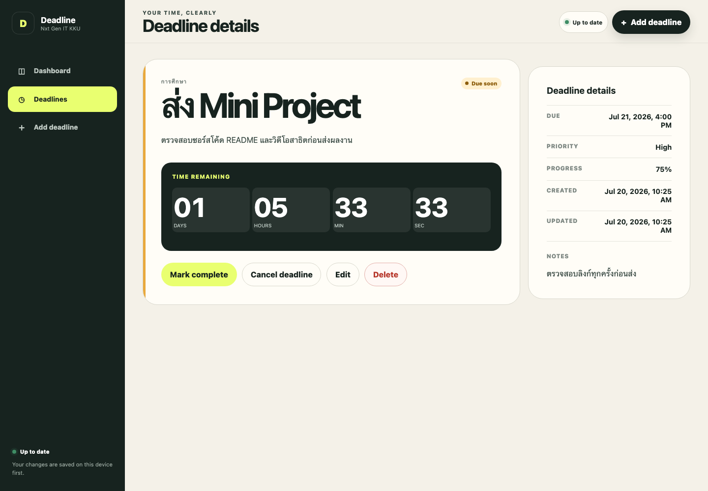
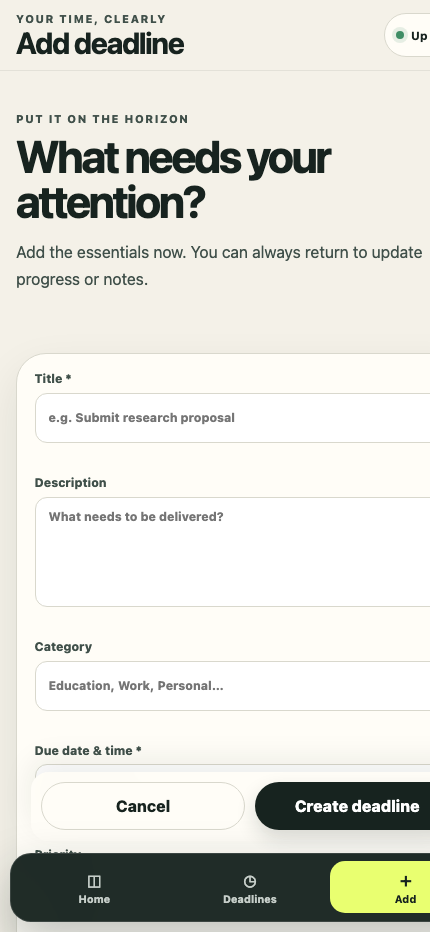
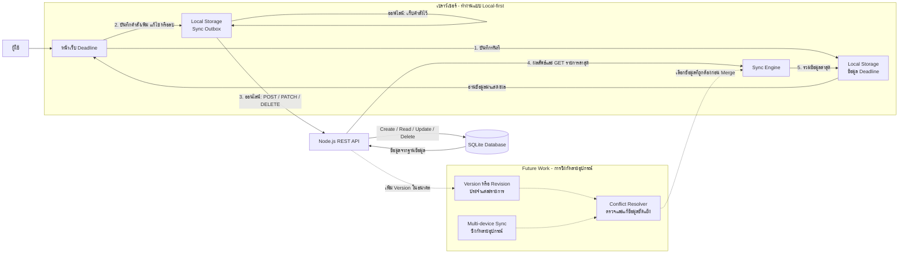

# Deadline - ระบบติดตามกำหนดส่งงาน

Mini Project สำหรับหลักสูตรการพัฒนากำลังคนสำหรับนักพัฒนาเว็บแอปพลิเคชันและแอปพลิเคชันบนอุปกรณ์เคลื่อนที่เพื่อเข้าสู่บริษัทซอฟต์แวร์ชั้นนำ (Nxt Gen IT KKU)

Deadline เป็น Web Application สำหรับบันทึกและติดตามกำหนดส่งงาน ผู้ใช้สามารถจัดการรายการงาน ดูเวลาคงเหลือ ติดตามความคืบหน้า และทำงานต่อได้แม้ไม่มีอินเทอร์เน็ต เมื่อกลับมาออนไลน์ระบบจะซิงก์ข้อมูลกับ Back-end API โดยอัตโนมัติ

## ผลการตรวจสอบตามขอบเขตงาน

**สรุป: โครงการตรงตามขอบเขตงานที่กำหนด** เมื่อรันผ่านเซิร์ฟเวอร์ Node.js ตามขั้นตอนในเอกสารนี้ โดยมีฟังก์ชัน CRUD, การค้นหาและกรอง, การสรุปข้อมูล, Back-end API และฐานข้อมูล SQLite ครบถ้วน

| ข้อกำหนดจากเอกสาร       | สิ่งที่โครงการรองรับ                                                                 | ผลตรวจสอบ |
| ----------------------- | ------------------------------------------------------------------------------------ | :-------: |
| เพิ่มข้อมูล             | เพิ่ม Deadline พร้อมชื่อ รายละเอียด ประเภท วันเวลา ความสำคัญ ความคืบหน้า และหมายเหตุ |   ผ่าน    |
| แสดงข้อมูล              | แสดงรายการในรูปแบบการ์ด พร้อมสถานะ เวลา ความคืบหน้า และความสำคัญ                     |   ผ่าน    |
| ดูรายละเอียด            | มีหน้ารายละเอียดของ Deadline แต่ละรายการ                                             |   ผ่าน    |
| แก้ไขข้อมูล             | แก้ไขข้อมูลเดิมและบันทึกการเปลี่ยนแปลงได้                                            |   ผ่าน    |
| ลบข้อมูลพร้อมยืนยัน     | แสดงกล่องข้อความยืนยันก่อนลบถาวร                                                     |   ผ่าน    |
| ค้นหาหรือกรอง           | ค้นหาด้วยคำสำคัญ กรองตามสถานะและความสำคัญ และเรียงลำดับได้                           |   ผ่าน    |
| ฟังก์ชันเฉพาะของระบบ    | คำนวณเวลาคงเหลือ ติดตามสถานะและความคืบหน้า และสรุปจำนวนรายการ                        |   ผ่าน    |
| หน้าสรุปยอดรวม          | Dashboard แสดงทั้งหมด ครบกำหนดวันนี้ เกินกำหนด และเสร็จแล้ว                          |   ผ่าน    |
| Web Application         | พัฒนาส่วนติดต่อผู้ใช้ด้วย HTML, CSS และ JavaScript                                   |   ผ่าน    |
| Back-end API            | พัฒนาด้วย Node.js และรองรับ Create, Read, Update, Delete                             |   ผ่าน    |
| การจัดเก็บข้อมูล        | ใช้ Local Storage สำหรับ Offline-first และ SQLite สำหรับข้อมูลฝั่งเซิร์ฟเวอร์        |   ผ่าน    |
| ผู้ใช้ 1 คนหรือ 1 บทบาท | ไม่มีระบบสมาชิกหรือการแบ่งสิทธิ์หลายระดับ                                            |   ผ่าน    |

> หมายเหตุ: `vercel.json` ปัจจุบันเผยแพร่เฉพาะโฟลเดอร์ `public/` เป็นเว็บไซต์แบบ static และไม่ได้เปิดใช้ Node.js API หรือ SQLite บน Vercel การสาธิต Back-end ตามขอบเขตจึงควรรันด้วย `npm start` หรือย้าย API ไปยังโฮสต์ Node.js ที่มีพื้นที่จัดเก็บข้อมูลถาวร ทั้งนี้เอกสารขอบเขตงานไม่ได้บังคับให้ Deploy ระบบขึ้นเซิร์ฟเวอร์จริง

## วัตถุประสงค์และเป้าหมาย

- ช่วยให้ผู้ใช้เห็นงานที่ใกล้ถึงกำหนดและงานที่เกินกำหนดได้อย่างรวดเร็ว
- ลดการพลาดกำหนดส่งด้วยตัวนับเวลาถอยหลังและการจัดระดับความสำคัญ
- ติดตามความคืบหน้าของแต่ละงานตั้งแต่ 0–100 เปอร์เซ็นต์
- รองรับการใช้งานบนโทรศัพท์และคอมพิวเตอร์ด้วย Responsive Web Design
- รองรับการใช้งานแบบ Offline-first และซิงก์กับ API เมื่อมีอินเทอร์เน็ต

## กลุ่มผู้ใช้งานเป้าหมาย

นักเรียน นักศึกษา พนักงาน หรือบุคคลทั่วไปที่ต้องการจัดการกำหนดส่งงานส่วนตัว โดยระบบออกแบบสำหรับผู้ใช้เพียง 1 คนหรือ 1 บทบาทตามขอบเขตงาน

## ฟังก์ชันหลักของระบบ

1. **เพิ่มข้อมูล** - สร้าง Deadline ใหม่ พร้อมตรวจสอบชื่อและวันเวลาที่จำเป็นต้องกรอก
2. **แสดงรายการ** - แสดงข้อมูลเป็นการ์ดที่อ่านง่าย พร้อมประเภท สถานะ วันเวลา ความสำคัญ และแถบความคืบหน้า
3. **ดูรายละเอียด** - แสดงข้อมูลครบถ้วนของแต่ละรายการ รวมถึงเวลาคงเหลือและหมายเหตุ
4. **แก้ไขและลบ** - แก้ไขข้อมูล ทำเครื่องหมายว่าเสร็จ ยกเลิก หรือลบโดยมีกล่องยืนยันก่อนลบ
5. **ค้นหาและกรอง** - ค้นหาจากชื่อ รายละเอียด หรือประเภท กรองตามสถานะและความสำคัญ และเรียงตามวันเวลา ความสำคัญ วันที่สร้าง หรือความคืบหน้า
6. **ติดตามสถานะ** - คำนวณสถานะอัตโนมัติเป็น กำลังจะมาถึง, ใกล้ครบกำหนด, ครบกำหนดวันนี้, เกินกำหนด, เสร็จตรงเวลา, เสร็จล่าช้า หรือยกเลิก
7. **สรุปข้อมูล** - Dashboard สรุปจำนวนรายการทั้งหมด รายการที่ครบกำหนดวันนี้ รายการเกินกำหนด และรายการที่เสร็จแล้ว
8. **ทำงานแบบออฟไลน์** - บันทึกข้อมูลลงอุปกรณ์ก่อน เก็บรายการรอซิงก์ใน Outbox และส่งข้อมูลไปยัง API เมื่อกลับมาออนไลน์
9. **ติดตั้งเป็น PWA** - มี Web App Manifest, Service Worker และไอคอนสำหรับติดตั้งบนอุปกรณ์

## ภาพตัวอย่างหน้าจอ

| Dashboard และสรุปข้อมูล                                                                    | รายการ Deadline พร้อมค้นหาและกรอง                                                                    |
| ------------------------------------------------------------------------------------------ | ---------------------------------------------------------------------------------------------------- |
|  |  |
| แสดงกำหนดส่งที่ต้องให้ความสนใจ ตัวนับเวลาถอยหลัง และยอดรวมตามสถานะ                         | แสดงรายการทั้งหมดเป็นการ์ด พร้อมค้นหา กรองสถานะ กรองความสำคัญ และเรียงลำดับ                          |

| รายละเอียด Deadline                                                                             | ฟอร์มเพิ่ม Deadline บนโทรศัพท์                                                      |
| ----------------------------------------------------------------------------------------------- | ----------------------------------------------------------------------------------- |
|  |  |
| แสดงรายละเอียด ความคืบหน้า หมายเหตุ และคำสั่งทำเสร็จ ยกเลิก แก้ไข หรือลบ                        | แสดงการออกแบบ Mobile-first พร้อมเมนูด้านล่างและฟอร์มที่เหมาะกับหน้าจอขนาดเล็ก       |

## ข้อกำหนดรายละเอียดของระบบ

### 1. ข้อกำหนดด้านการทำงาน

#### 1.1 การเพิ่มข้อมูล

- ผู้ใช้ต้องสามารถสร้าง Deadline ใหม่ได้
- ต้องระบุ `title` และ `dueDateTime`
- สามารถระบุ `description`, `category`, `priority`, `progress` และ `notes` เพิ่มเติมได้
- `priority` ต้องเป็น `high`, `medium` หรือ `low`
- `progress` ต้องเป็นจำนวนเต็มตั้งแต่ 0 ถึง 100
- ระบบสร้างรหัสในรูปแบบ `deadline-<UUID>` เพื่อให้รายการเดียวกันใช้รหัสเดิมระหว่างการซิงก์

#### 1.2 การแสดงและดูรายละเอียด

- ระบบต้องแสดงรายการที่บันทึกไว้ในรูปแบบการ์ด
- ผู้ใช้ต้องเลือกเปิดหน้ารายละเอียดของแต่ละรายการได้
- ระบบต้องแสดงวันครบกำหนด ความสำคัญ ความคืบหน้า วันที่สร้าง วันที่แก้ไข และหมายเหตุ
- ระบบต้องคำนวณสถานะตามเวลาเมื่ออ่านข้อมูล โดยไม่บันทึกสถานะคำนวณซ้ำลงฐานข้อมูล

#### 1.3 การแก้ไข ลบ และเปลี่ยนสถานะ

- ผู้ใช้ต้องแก้ไขข้อมูลที่บันทึกไว้ได้
- ผู้ใช้ต้องทำเครื่องหมายว่าเสร็จหรือยกเลิกรายการได้
- เมื่อทำเครื่องหมายว่าเสร็จ ระบบตั้งความคืบหน้าเป็น 100 เปอร์เซ็นต์และบันทึกเวลาเสร็จ
- ระบบแยกผลว่าเสร็จตรงเวลาหรือเสร็จล่าช้าโดยเปรียบเทียบ `completedAt` กับ `dueDateTime`
- การลบต้องแสดงข้อความยืนยันก่อนดำเนินการ

#### 1.4 การค้นหา กรอง และเรียงลำดับ

- ค้นหาจากชื่อ รายละเอียด และประเภทได้
- กรองตามสถานะที่คำนวณได้
- กรองตามระดับความสำคัญได้
- API รองรับการกรองประเภทแบบตรงกันโดยไม่สนใจตัวพิมพ์เล็กหรือใหญ่
- เรียงตามกำหนดใกล้ที่สุด กำหนดไกลที่สุด ความสำคัญ วันที่สร้างล่าสุด หรือความคืบหน้าได้

#### 1.5 การสรุปและติดตามสถานะ

- Dashboard ต้องแสดง Deadline ที่ใกล้ที่สุดและตัวนับเวลาถอยหลัง
- ต้องสรุปจำนวนรายการทั้งหมด ครบกำหนดวันนี้ เกินกำหนด และเสร็จแล้ว
- ต้องแสดงรายการที่ต้องให้ความสนใจและรายการที่จะมาถึง
- สถานะเวลาต้องมี `upcoming`, `due-soon`, `due-today`, `overdue`, `completed-on-time`, `completed-late` และ `cancelled`

### 2. ข้อกำหนดด้านเทคโนโลยี

- **Frontend:** HTML, CSS และ JavaScript แบบไม่พึ่ง Framework
- **Back-end:** Node.js REST API
- **ฐานข้อมูลฝั่งเซิร์ฟเวอร์:** SQLite ผ่าน `node:sqlite`
- **ข้อมูลฝั่งอุปกรณ์:** Browser Local Storage
- **รูปแบบแอป:** Responsive Web Application และ Progressive Web App
- **รูปแบบผู้ใช้:** ผู้ใช้ 1 คนหรือ 1 บทบาท ไม่มีการสมัครสมาชิกและเข้าสู่ระบบ

### 3. ข้อกำหนดด้านข้อมูล

| ฟิลด์             | ชนิด/ข้อจำกัด        | รายละเอียด                             |
| ----------------- | -------------------- | -------------------------------------- |
| `id`              | String, ไม่ซ้ำ       | รหัส `deadline-<UUID>`                 |
| `title`           | String, จำเป็น       | ชื่อกำหนดส่ง                           |
| `description`     | String               | รายละเอียดงาน                          |
| `category`        | String               | ประเภทของงาน                           |
| `dueDateTime`     | ISO 8601, จำเป็น     | วันและเวลาครบกำหนด                     |
| `priority`        | Enum                 | `high`, `medium`, `low`                |
| `progress`        | Integer              | 0–100                                  |
| `notes`           | String               | หมายเหตุเพิ่มเติม                      |
| `completionState` | Enum                 | `incomplete`, `completed`, `cancelled` |
| `completedAt`     | ISO 8601 หรือ `null` | เวลาเสร็จงาน                           |
| `createdAt`       | ISO 8601             | เวลาสร้างรายการ                        |
| `updatedAt`       | ISO 8601             | เวลาแก้ไขล่าสุด                        |

### 4. ข้อกำหนดด้าน Back-end API

| Method   | Endpoint             | การทำงาน                       |
| -------- | -------------------- | ------------------------------ |
| `GET`    | `/api/health`        | ตรวจสอบสถานะ API               |
| `GET`    | `/api/deadlines`     | แสดงรายการ Deadline            |
| `POST`   | `/api/deadlines`     | เพิ่ม Deadline                 |
| `GET`    | `/api/deadlines/:id` | ดู Deadline ตามรหัส            |
| `PUT`    | `/api/deadlines/:id` | แทนที่ข้อมูลที่แก้ไขได้ทั้งหมด |
| `PATCH`  | `/api/deadlines/:id` | แก้ไขบางฟิลด์หรือเปลี่ยนสถานะ  |
| `DELETE` | `/api/deadlines/:id` | ลบ Deadline                    |

พารามิเตอร์ของ endpoint รายการ:

| Query parameter | รายละเอียด                                                          |
| --------------- | ------------------------------------------------------------------- |
| `q`             | ค้นหาจากชื่อ รายละเอียด และประเภท                                   |
| `status`        | กรองตามสถานะที่คำนวณได้                                             |
| `priority`      | กรอง `high`, `medium` หรือ `low`                                    |
| `category`      | กรองประเภทแบบตรงกันโดยไม่สนใจตัวพิมพ์                               |
| `sort`          | `nearest`, `latest`, `priority`, `recently-created` หรือ `progress` |

### 5. ข้อกำหนดการทำงานแบบออฟไลน์

1. บันทึกการเปลี่ยนแปลงลง Local Storage ก่อน
2. เก็บคำสั่งเพิ่ม แก้ไข หรือลบที่ยังไม่ซิงก์ไว้ใน Outbox
3. ส่ง Outbox ไปยัง API เมื่ออุปกรณ์ออนไลน์
4. ลบคำสั่งออกจาก Outbox หลัง API ตอบกลับสำเร็จ
5. Service Worker แคช Application Shell แต่ไม่ใช้แคชเป็นฐานข้อมูล Deadline

### 6. แผนภาพการบันทึกและซิงก์ข้อมูล



ลำดับการทำงานปัจจุบัน:

1. เมื่อผู้ใช้เพิ่ม แก้ไข หรือลบ Deadline ระบบจะเปลี่ยนข้อมูลใน Local Storage ก่อน ทำให้หน้าจอตอบสนองได้ทันทีและใช้งานต่อได้ขณะออฟไลน์
2. ระบบบันทึกคำสั่งเดียวกันลง Sync Outbox โดยรวมคำสั่งที่ซ้ำกันของ Deadline เดียวกันเพื่อลดการส่งข้อมูลที่ไม่จำเป็น
3. เมื่อออนไลน์ Sync Engine จะส่งคำสั่งจาก Outbox ไปยัง Node.js API ตามลำดับ
4. API ตรวจสอบข้อมูลและบันทึกลง SQLite จากนั้น Browser จะดึงรายการล่าสุดกลับมา
5. ระบบรวมข้อมูลจากเซิร์ฟเวอร์กับ Local Storage โดยไม่เขียนทับรายการที่ยังมีคำสั่งรอซิงก์ และลบคำสั่งออกจาก Outbox เมื่อ API ตอบกลับสำเร็จ

### 7. Future Work ด้านการซิงก์ข้อมูล

ระบบปัจจุบันเหมาะสำหรับผู้ใช้หนึ่งคนบนอุปกรณ์หลัก และรองรับการทำงาน Offline-first แล้ว แต่ก่อนเปิดใช้การซิงก์หลายอุปกรณ์ควรพัฒนาเพิ่มเติมดังนี้:

- เพิ่ม `version` หรือ `revision` ให้แต่ละ Deadline เพื่อระบุว่าข้อมูลฝั่งใดใหม่กว่าอย่างเชื่อถือได้
- ใช้ Optimistic Concurrency Control เช่น `ETag`/`If-Match` หรือเงื่อนไขตรวจสอบ Version ก่อนแก้ไขข้อมูลใน SQLite
- กำหนดนโยบายจัดการข้อมูลขัดแย้งอย่างชัดเจน เช่น Server wins, Client wins หรือให้ผู้ใช้เลือกข้อมูลที่ต้องการเก็บ
- เพิ่ม Conflict Resolver ก่อนขั้นตอน Merge เพื่อป้องกันการแก้ไขจากอุปกรณ์หนึ่งเขียนทับอีกอุปกรณ์โดยไม่แจ้งเตือน
- เพิ่มกลไก Retry แบบหน่วงเวลาและ Idempotency Key เพื่อให้การส่งคำสั่งซ้ำหลังเครือข่ายขัดข้องปลอดภัยยิ่งขึ้น
- เพิ่มการทดสอบกรณีสองอุปกรณ์แก้ไข Deadline เดียวกัน ลบข้อมูลระหว่างออฟไลน์ และกลับมาออนไลน์พร้อมกัน

## ขอบเขตที่ไม่บังคับ

ตามเอกสารโครงการไม่บังคับให้มีระบบต่อไปนี้ และโครงการนี้ไม่ได้พึ่งพาฟังก์ชันเหล่านี้เพื่อให้ผ่านขอบเขตหลัก:

- ระบบสมัครสมาชิกและเข้าสู่ระบบ
- การแบ่งสิทธิ์ผู้ใช้งานหลายระดับ
- การอัปโหลดรูปภาพหรือเอกสาร
- Dashboard ขั้นสูง
- ระบบแจ้งเตือน
- การเชื่อมต่อระบบชำระเงิน
- การส่งออกรายงาน PDF หรือ Excel
- การ Deploy ขึ้น Server จริง
- การใช้ AI ภายในระบบ

## การติดตั้งและใช้งาน

### ความต้องการของระบบ

- Node.js 24 ขึ้นไป เนื่องจากใช้ `node:sqlite`

### เริ่มต้นระบบ

```bash
npm start
```

เปิด [http://localhost:3000](http://localhost:3000) เซิร์ฟเวอร์เดียวกันจะให้บริการทั้งหน้าเว็บและ API พร้อมสร้างฐานข้อมูล `data/deadlines.db` โดยอัตโนมัติ

### ตัวแปรสภาพแวดล้อม

| ตัวแปร           | ค่าเริ่มต้น         | การใช้งาน                    |
| ---------------- | ------------------- | ---------------------------- |
| `PORT`           | `3000`              | พอร์ต HTTP                   |
| `DATABASE_PATH`  | `data/deadlines.db` | ตำแหน่งไฟล์ SQLite           |
| `ALLOWED_ORIGIN` | `*`                 | Origin ที่อนุญาตให้เรียก API |

## การทดสอบ

```bash
npm test
```

หรือตรวจสอบทั้งชุดทดสอบและไวยากรณ์ JavaScript:

```bash
npm run check
```

ชุดทดสอบครอบคลุม CRUD, Validation, การคำนวณสถานะ, การค้นหา, การกรอง, การเรียงลำดับ, Frontend Domain และ Local Store

## บทสรุปและข้อเสนอแนะ

โครงการมีองค์ประกอบหลักครบตามขอบเขต Mini Project และเพิ่มความสามารถ Offline-first กับ PWA ซึ่งเป็นฟังก์ชันเสริมที่เหมาะกับระบบติดตามกำหนดส่ง ก่อนส่งผลงานควรบันทึกวิดีโอสาธิตตั้งแต่เพิ่ม ดูรายละเอียด แก้ไข ค้นหา/กรอง ลบพร้อมยืนยัน ไปจนถึงการแสดงข้อมูลใน SQLite และตรวจสอบว่าลิงก์หรือ QR Code ที่ใช้ส่งงานเปิดได้จริง

## สัญญาอนุญาต

ดูรายละเอียดใน [LICENSE](LICENSE)
